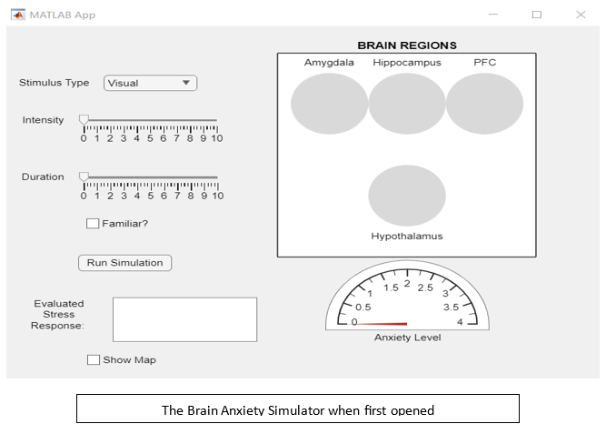
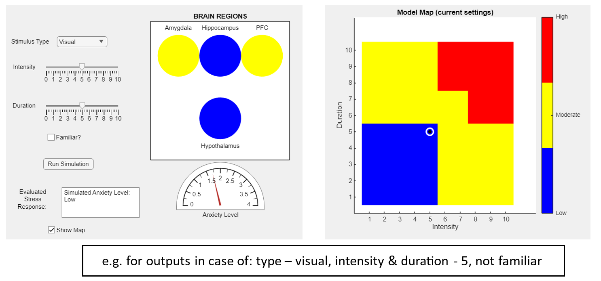

# Brain Anxiety Simulator

Interactive MATLAB application for simulating anxiety-related brain activity.

## 🧠 Overview
This project is an educational simulation that demonstrates how different factors influence anxiety levels in the brain.

The model is based on four key inputs:
- Stimulus type (visual, auditory, olfactory)
- Intensity
- Duration
- Familiarity (whether the stimulus is known or not)

These inputs are processed through a simplified brain model to produce an overall anxiety response.

## 🧬 Brain Model
The simulation represents four main brain regions:

- **Amygdala** – evaluates emotional intensity  
- **Hippocampus** – incorporates memory and familiarity  
- **Prefrontal Cortex (PFC)** – regulates and moderates the response  
- **Hypothalamus** – integrates signals into a final anxiety output  

## 🎯 Features
- Interactive GUI built in MATLAB  
- Adjustable stimulus parameters (type, intensity, duration, familiarity)  
- Visual representation of brain region activity (color-coded)  
- Anxiety level gauge (numeric + verbal: Low / Moderate / High)  
- Optional heatmap showing anxiety levels across intensity & duration  
- Highlighting of current position on the map based on selected inputs  

## 🧪 How It Works
Users can simulate different scenarios by adjusting input parameters.

The system calculates:
- Activity levels in each brain region  
- Overall anxiety score  

Results are displayed using:
- Color changes (blue → yellow → red)  
- A visual gauge  
- A descriptive anxiety level  

## 🖥️ Screenshots

### Initial State

### Simulation Example

## 📄 Documentation
For a more detailed explanation of the model and system behavior, see the full user manual:

[User Manual](Brain%20Anxiety%20Simulator%20user%20guide.docx)

## ⚠️ Disclaimer
This project is a simplified educational model and does not represent real clinical or biological data.

## ⚙️ Technologies
- MATLAB (App Designer)
